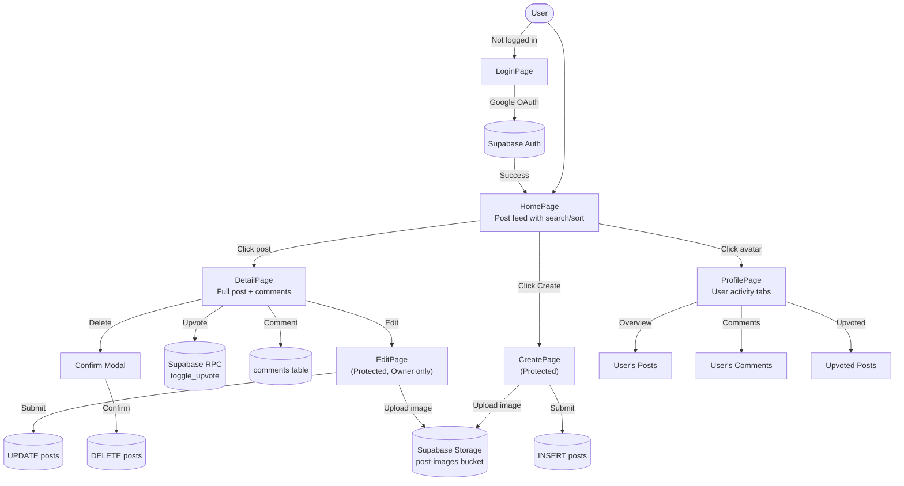
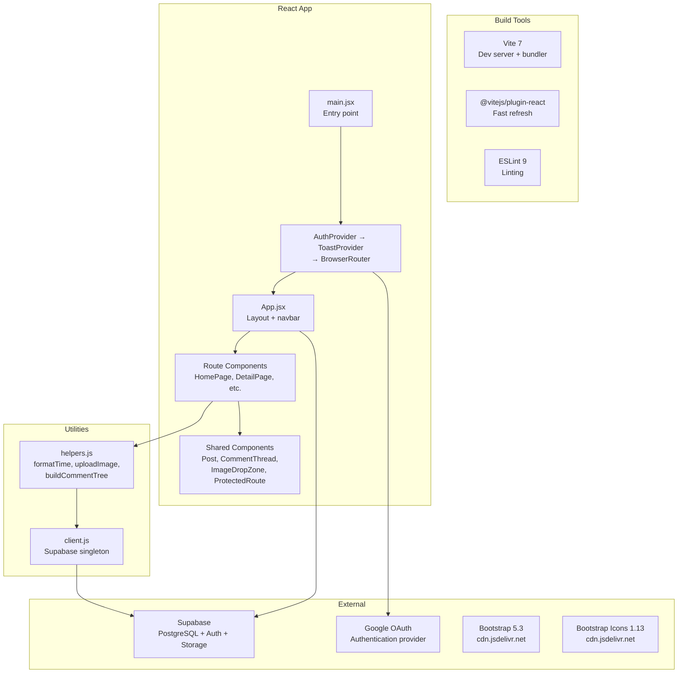
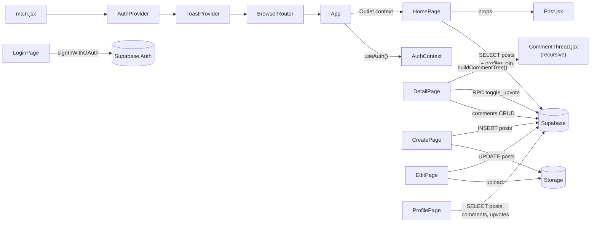
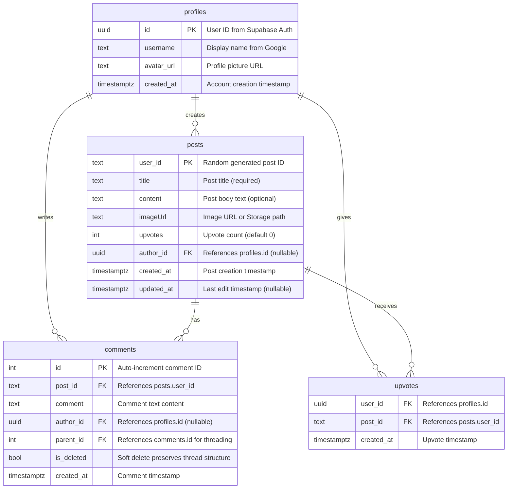
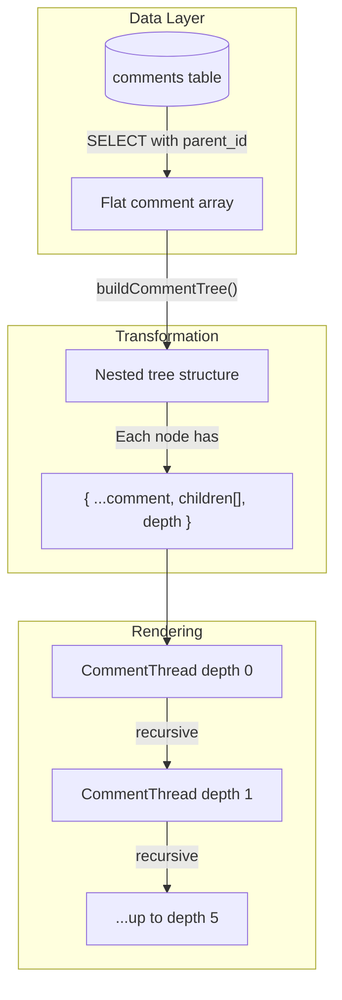
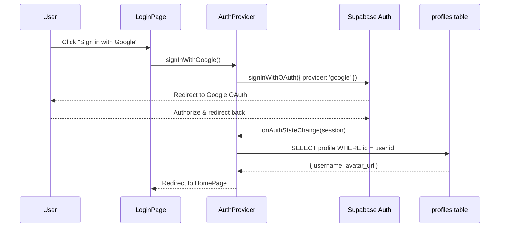

# *purpleit* project

A Reddit-style community post board built with React 18 + Vite. Features Google OAuth authentication, real-time upvoting, threaded comments, user profiles, and image uploads via Supabase backend.

**Live site**: [https://hoangngo-sudo.github.io/purpleit/](https://hoangngo-sudo.github.io/purpleit/)

## Demo

https://github.com/user-attachments/assets/a7d65327-f1da-40e8-ac16-aed48a87d614

## Architecture



## Features

- **Google OAuth authentication** Sign in with Google, user profiles, avatar display in navbar and post cards
- **Community post board** Create posts with title, content, and images (URL or file upload); browse with infinite scroll pagination
- **Server-side search & sort** Debounced search by title (300ms), sort by date or upvotes, all executed on Supabase
- **Toggle upvotes** Upvote/un-upvote posts with optimistic UI; server-authoritative state via Supabase RPC
- **Threaded comments** Nested replies up to 5 levels deep with collapsible threads, visual connector lines, inline reply forms, and OP badges for post author comments
- **User profiles** Tabbed activity view showing posts, comments, and upvoted content
- **Author-based ownership** Only post owners can edit/delete; multi-layer auth guards (route, component, action, server)
- **Protected routes** Create and Edit pages require authentication; automatic redirect with toast notification
- **Image uploads** Drag-and-drop zone with preview (50MB max), or paste external URL; stored in Supabase Storage
- **Toast notifications** Context-based system with animated entry/exit (success, error, info types)
- **Responsive design** Bootstrap 5 with custom indigo color scheme and Inter font

## Tech Stack



| Dependency | Purpose |
|---|---|
| React 18 | UI framework with StrictMode |
| React Router 6 | Client-side routing with outlet context |
| [@supabase/supabase-js](https://supabase.com/docs/reference/javascript) | Database, auth, and storage client |
| [Bootstrap 5.3](https://getbootstrap.com/) | CSS/JS UI kit |
| [Bootstrap Icons](https://icons.getbootstrap.com/) | Icon font |
| Vite 7 | Build tool with HMR |
| Github Pages | GitHub Pages deployment |

## Build

```bash
npm install
npm run dev
```

Before running, create a `.env` file from `.env.example` and set:

- `VITE_SUPABASE_URL`
- `VITE_SUPABASE_ANON_KEY`

For production build:

```bash
npm run build
npm run preview
```

For GitHub Pages deployment:

```bash
npm run deploy
```

## Project Structure

```
.
├── src/
│   ├── main.jsx              # Entry point, provider setup
│   ├── App.jsx               # Root layout, navbar, outlet
│   ├── index.css             # Global styles, indigo theme
│   ├── routes/
│   │   ├── HomePage.jsx      # Post feed with infinite scroll
│   │   ├── DetailPage.jsx    # Single post view + comments
│   │   ├── CreatePage.jsx    # New post form (protected)
│   │   ├── EditPage.jsx      # Edit post form (protected)
│   │   ├── LoginPage.jsx     # Google OAuth login
│   │   └── ProfilePage.jsx   # User profile with tabs
│   ├── components/
│   │   ├── Post.jsx          # Post card component
│   │   ├── CommentThread.jsx # Recursive threaded comments
│   │   ├── ProtectedRoute.jsx# Auth guard wrapper
│   │   └── ImageDropZone.jsx # Drag-drop upload zone
│   ├── contexts/
│   │   ├── AuthContext.jsx   # Google OAuth provider
│   │   ├── useAuth.js        # Auth hook
│   │   ├── ToastContext.jsx  # Toast notification provider
│   │   └── useToast.js       # Toast hook
│   └── utils/
│       ├── client.js         # Supabase client singleton
│       └── helpers.js        # Shared utilities
├── public/
│   └── netlify.toml          # SPA redirect config
└── vite.config.js            # Base path: /purpleit/
```

## Component & Data Flow



## Database Schema



**Key Tables:**

| Table | Purpose | Notes |
|---|---|---|
| `profiles` | User profile data | Populated via Supabase Auth trigger on Google sign-in |
| `posts` | Community posts | `author_id` is nullable for legacy anonymous posts |
| `comments` | Threaded comments | `parent_id` enables nested replies; `is_deleted` preserves thread structure |
| `upvotes` | User upvote tracking | Composite key on `(user_id, post_id)` prevents duplicate upvotes |

**Supabase Storage:**
- **Bucket:** `post-images` (public)
- **Purpose:** Store uploaded post images
- **Max size:** 50MB per image

**Supabase RPC Functions:**
- **`toggle_upvote(p_post_id text)`** Atomically toggles upvote state and returns authoritative count

## Threaded Comments



**Features:**
- Recursive `CommentThread` component renders nested replies
- Visual thread lines connect parent-child comments
- Collapsible threads with reply count
- Inline reply forms with auth guard
- OP badge for post author comments
- Soft-deleted comments show `[Comment Deleted]` preserving thread structure

## Auth Flow



## License

MIT
